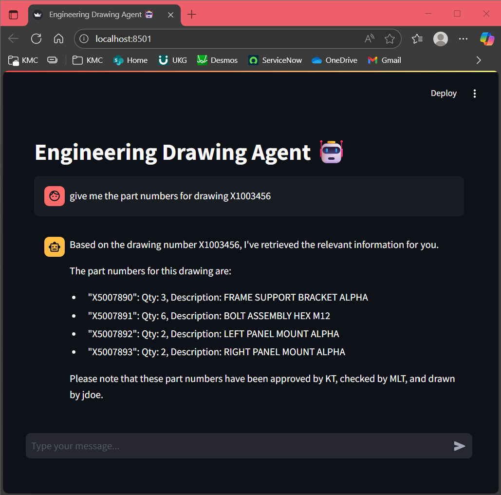
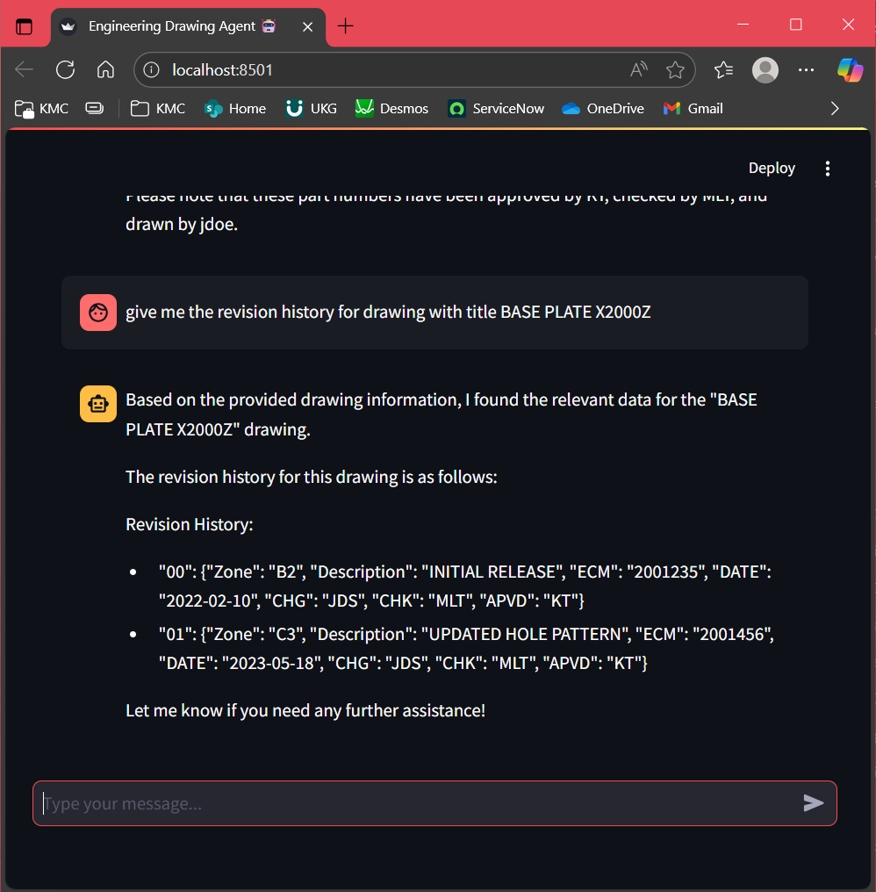

# Engineering Drawing Data Agent

A local AI-powered assistant for querying structured engineering drawing data using natural language.

## Features

- **ChromaDB**: Vectorizes and stores drawing metadata for semantic search.  
- **Streamlit UI**: Simple interface for uploading JSON files and chatting with the agent.  
- **Ollama**: Handles both embedding and conversational AI locally.  
- **Local-first**: All data processing and interaction happens on your machine.  

## Workflow

1. Upload a JSON file containing engineering drawing metadata (e.g., part numbers, titles, revisions, weld callouts).  
2. The agent vectorizes the data using ChromaDB and stores it locally.  
3. A chatbot interface opens via Streamlit.  
4. Ask questions in natural language; Ollama retrieves and responds using the embedded data.  

## Tech Stack

- `ChromaDB` for vector storage  
- `Streamlit` for UI  
- `Ollama` for embedding and chat  
- `Python` for backend logic  

## Use Case

Designed for engineers and technical teams needing fast, local access to drawing records without cloud dependencies. Supports conversational queries over thousands of entries.  

---

## Full Setup Guide (No Prerequisites Assumed)

### 1. Install Python
Make sure you have **Python 3.10+** installed. You can check with:
```bash
python --version
```
If not installed, download it from [Python.org](https://www.python.org/downloads/).  

---

### 2. Install Ollama
Ollama is required for embeddings and LLM responses.  

- **macOS / Linux:**  
  Download and install from [https://ollama.com/download](https://ollama.com/download).  
- **Windows (WSL2 required):**  
  Follow the instructions at [Ollama for Windows](https://ollama.com/download/windows).  

Verify installation:
```bash
ollama --version
```

### 3. Create a Virtual Environment
It’s recommended to isolate dependencies.  

```bash
python -m venv drawingDataEnv
```

Activate it:
- **Windows (PowerShell):**
  ```bash
  drawingDataEnv\Scripts\Activate
  ```
- **macOS/Linux:**
  ```bash
  source drawingDataEnv/bin/activate
  ```

---

---

### 4. Clone the Repository
```bash
git clone https://github.com/RylanBosquez/engineeringDrawingDataAgent.git
cd engineeringDrawingDataAgent
```

---

### 5. Install Dependencies
```bash
pip install --upgrade pip
pip install -r requirements.txt
```

---

### 6. Pull Required Ollama Models
```bash
ollama pull nomic-embed-text
ollama pull llama3.2
```

---

## Running the App

Start the Streamlit interface:
```bash
streamlit run app.py
```

---

## Example Usage

### Searching database using a specified part number:


### Searching database using a specified title:

